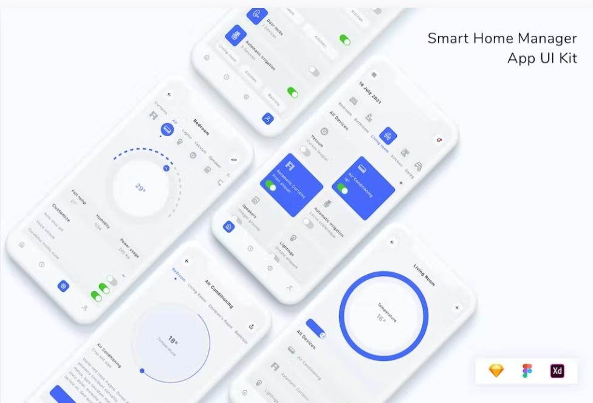
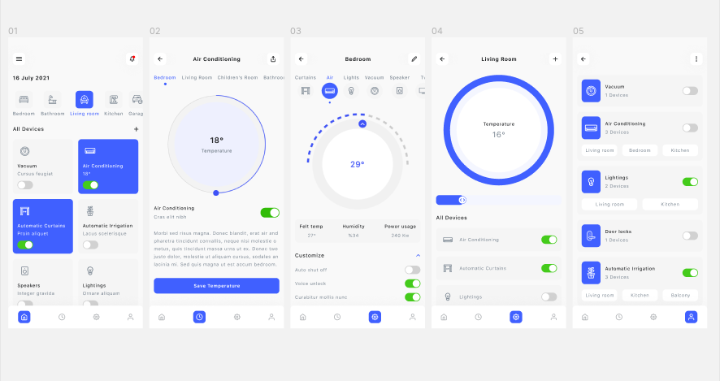
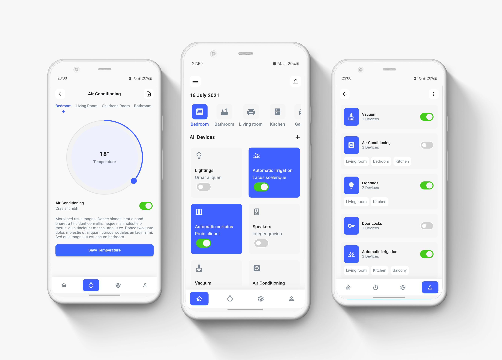

# Smart Home Mobile App:
## envato files :
 



## my app :
the only deference is the icons .


## Installation :
1. clone this repo
2. cd into the directory
3. download dependencies
```
flutter pub get
```
4. run the app
```
flutter run
```
